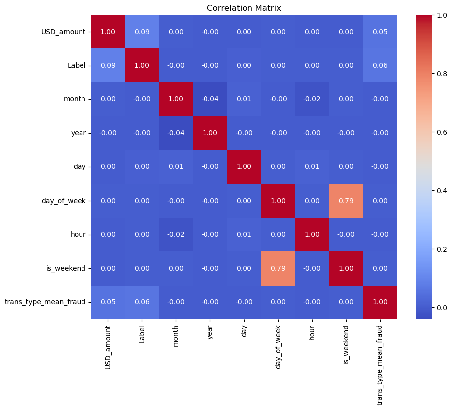

  
# SecureSwipe

## Author Sinegugu Mthembu
### Using synthetic data. Chosen models are XGBoost and Random frest classifier models

##### This project aims to develop an advanced credit card fraud detection system leveraging cutting-edge feature engineering techniques. Our dataset comprises credit card transactions of U.S. users spanning a period of 20 years. Innovative feature engineering techniques will be employed to create predictive features that capture nuanced patterns of fraud. By combining traditional features with novel ones, the  aim is to enhance the accuracy and robustness of the detection model.
##### The data comprises over a million rows. Each row corresponds to unique transactions conducted by users, encompassing comprehensive information such as sender details, receiver details, transaction amount in dollars, and, most critically, whether the transaction has been flagged as fraudulent or legitimate. It is important to note that this dataset exhibits a significant class imbalance, with a relatively low proportion of fraudulent transactions compared to legitimate ones. This inherent imbalance will be meticulously addressed and carefully managed during the model development and training process to ensure the highest levels of predictive accuracy and fraud detection efficiency.

<!--- [alt text](https://github.com/Sine-Mthembu/SecureSwipe/blob/main/image.jpg?raw=true) -->

# Feature Engineering and Data Analysis

Feature engineering techniques were applied to create new variables that effectively capture transaction patterns and behaviors. This involved extracting additional information from the dataset, leveraging features such as date and time. For instance, our analysis revealed that fraudulent transactions are more prevalent during nighttime compared to the morning. Additionally, we discovered that, on average, fraudulent transactions tend to involve cash payments more frequently than other transaction types.

**Figure 1:** Number of transactions per week day.

**Figure 2:** Comparison of the number of transactions for each transaction type for fraudulent transactions.

These newly engineered features play a crucial role in enhancing the performance of machine learning algorithms.

## Feature Importance and Correlation Analysis

After conducting thorough data analysis, it becomes essential to select the most important features for model training. Feature importance can be determined through correlation analysis. However, a prerequisite for correlation analysis is encoding non-numerical data into numerical formats. In our dataset, the encoding process was feature-specific.

For instance, given the insight that "Make payment" and "Quick payment" transactions were likely targets for fraud, we employed encoding techniques such as label encoding and one-hot encoding for various columns. An example of a correlation matrix can be seen below.

**Figure 3:** Correlation matrix.

## Handling Fraudulent Transactions

Fraudulent transactions themselves can be considered as outliers. Therefore, for this project, we have adopted the approach of leaving these outliers as they are. This decision was made to ensure that these anomalies are retained for analysis and model training.

